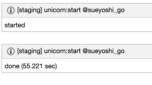

# Capistrano::AroundChatwork

[](http://badge.fury.io/rb/capistrano-around_chatwork)
[](https://codeclimate.com/github/sue445/capistrano-around_chatwork)

post to [ChatWork](http://www.chatwork.com/) before and after the specified task



## Installation

Add this line to your application's Gemfile:

```ruby
group :development do
  gem 'capistrano-around_chatwork', require: false
end
```

## Usage

Capfile

```ruby
require "capistrano/around_chatwork"
```

config/deploy.rb

```ruby
set :chatwork_api_token, "YOUR_API_TOKEN"
set :chatwork_room_id,   00000000

around_chatwork "deploy"
```

## Customize
If you want to customize starting and ending mesasge, set `starting_message` and `ending_message`

example

```ruby
set :starting_message, -> {
  "[info][title][#{fetch(:stage)}] :task_name: @#{fetch(:user)}[/title]started[/info]"
}

set :ending_message, -> {
  "[info][title][#{fetch(:stage)}] :task_name: @#{fetch(:user)}[/title]done (:elapsed_time: sec)[/info]"
}
```

* `:task_name:` is replaced to current task name (ex. `deploy`)
* `:elapsed_time:` is replaced to elapsed time of task (ex. `1.234`)

## Development

After checking out the repo, run `bin/setup` to install dependencies. Then, run `bin/console` for an interactive prompt that will allow you to experiment.

To install this gem onto your local machine, run `bundle exec rake install`. To release a new version, update the version number in `version.rb`, and then run `bundle exec rake release` to create a git tag for the version, push git commits and tags, and push the `.gem` file to [rubygems.org](https://rubygems.org).

## Contributing

1. Fork it ( https://github.com/sue445/capistrano-around_chatwork/fork )
2. Create your feature branch (`git checkout -b my-new-feature`)
3. Commit your changes (`git commit -am 'Add some feature'`)
4. Push to the branch (`git push origin my-new-feature`)
5. Create a new Pull Request
